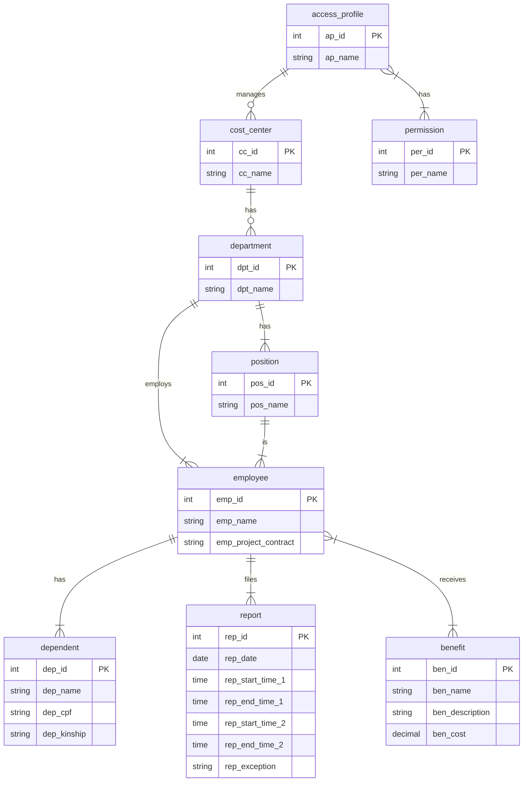

# xcptn-api

```mermaid
erDiagram
    cost_center {
        int cc_id PK
        string cc_name
    }

    department {
        int dpt_id PK
        string dpt_name
    }

    position {
        int pos_id PK
        string pos_name
    }

    employee {
        int emp_id PK
        string emp_name
        string emp_project_contract
    }

    dependent {
        int dep_id PK
        string dep_name
        string dep_cpf
        string dep_kinship
    }

    report {
        int rep_id PK
        date rep_date
        time rep_start_time_1
        time rep_end_time_1
        time rep_start_time_2
        time rep_end_time_2
        string rep_exception
    }

    benefit {
        int ben_id PK
        string ben_name
        string ben_description
        decimal ben_cost
    }

    access_profile {
        int ap_id PK
        string ap_name
    }

    permission {
        int per_id PK
        string per_name
    }

    cost_center ||--o{ department : "has"
    department ||--|{ position : "has"
    department ||--|{ employee : "employs"
    position ||--|{ employee : "is"
    employee ||--|{ dependent : "has"
    employee ||--|{ report : "files"
    employee }|--|{ benefit : "receives"
    access_profile ||--o{ cost_center : "manages"
    access_profile }|--|{ permission : "has"
```
